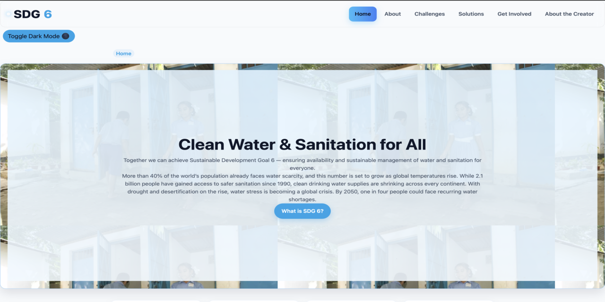

# SDG 6 Awareness Website

## Overview
This project is a responsive educational website developed to promote awareness of United Nations Sustainable Development Goal 6 (Clean Water and Sanitation).

The website provides information on global water challenges, sustainable solutions, and ways individuals can contribute toward achieving SDG 6.

## Technologies Used
- HTML5
- CSS3
- JavaScript

## Features
- Responsive design
- Dark mode support
- Accessibility enhancements
- Interactive statistics section
- Educational content pages
- Mobile-friendly navigation
- Keyboard accessibility

## Pages
- Home
- About SDG 6
- Challenges
- Solutions
- Get Involved
- Creator

## Learning Outcomes
This project strengthened skills in:

- Front-end web development
- Responsive design
- User interface design
- Accessibility implementation
- JavaScript interactivity
- Website optimization

## Author
Azriel Williams

Diploma in Software Engineering  
University of Trinidad and Tobago

## Live Website
[View Website] https://azriel-williams.github.io/SDG6Website/

